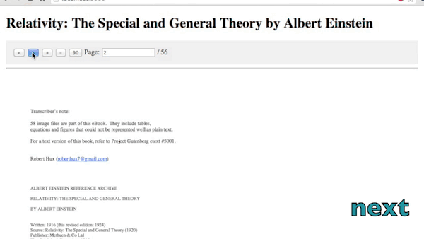

# angular-pdf [](https://travis-ci.org/sayanee/angularjs-pdf) [](https://gemnasium.com/sayanee/angularjs-pdf)

Version: 1.2.9

>An [AngularJS](http://angularjs.org/) [directive](http://docs.angularjs.org/guide/directive) `ng-pdf` to display PDF files with [PDFJS](http://mozilla.github.io/pdf.js/).

## Overview [[demo](http://sayan.ee/angularjs-pdf/)]

Integrate PDF files right into web pages.



##Requirements

Check [`bower.json` file](https://github.com/sayanee/angularjs-pdf/blob/master/bower.json) for dependencies and their versions:

1. [AngularJS](http://angularjs.org/) - get the latest [angular.min.js](https://developers.google.com/speed/libraries/devguide#angularjs)
- [PDFJS](http://mozilla.github.io/pdf.js/) - build the files [`pdf.js` and `pdf.worker.js`](https://github.com/mozilla/pdf.js#building-pdfjs)
- [Evergreen browsers](https://github.com/mozilla/pdf.js/wiki/Frequently-Asked-Questions#what-browsers-are-supported)

##Features

1. next / previous page
- zoom in / out / fit 100%
- rotate clockwise
- jump to a page number
- when scrolling, the pdf controls will get fixed position at the top
- define the view template
- define the path to pdf with scope variable
- handles error
- show loading of pdf
- show progress percentage of loading pdf
- dynamically change the pdf url
- support retina canvas

## Getting Started

1. install or copy over the file `dist/angular-pdf.min.js` or `dist/angular-pdf.js`

    ```shell
    bower install angular-pdf
    ```
1. include the path to the direcitve file in `index.html`

    ```html
    <script src="js/vendor/angular-pdf/dist/angular-pdf.js"></script>
    ```

1. include the directive as a dependency when defining the angular app:

    ```js
    var app = angular.module('App', ['pdf']);
    ```
1. include the directive with the attribute path to the partial under a controller

    ```html
    <div class="wrapper" ng-controller="DocCtrl">
        <ng-pdf template-url="/partials/viewer.html"></ng-pdf>
    </div>
    ```
    - `scale` as an option

        ```html
        <ng-pdf template-url="/partials/viewer.html" scale=1></ng-pdf>
        ```

        `scale` attribute can also be `page-fit`

        ```html
        <ng-pdf template-url="/partials/viewer.html" scale="page-fit"></ng-pdf>
        ```
    - `page` as an option for initial page number

        ```html
        <ng-pdf template-url="/partials/viewer.html" page=12></ng-pdf>
        ```

1. include the `canvas` element to display the pdf in the template-url file

    ```html
    <canvas id="pdf-canvas"></canvas>
    ```
1. include the path to the pdf file in the controller

    ```js
    app.controller('DocCtrl', function($scope) {
        $scope.pdfUrl = '/pdf/relativity.pdf';
    });
    ```

###Options

1. **Next / Previous page**: Include the controls in the view file as defined in the attribute `template-url`

    ```
    <button ng-click="goPrevious()"><</span></button>
    <button ng-click="goNext()">></span></button>
    ```
1. **Zoom in / out / fit 100%**: Include the controls in the view file as defined in the attribute `template-url`

    ```
    <button ng-click="zoomIn()">+</span></button>
    <button ng-click="fit()">100%</span></button>
    <button ng-click="zoomOut()">-</span></button>
    ```
1. **Rotate clockwise**: Include the controls in the view file as defined in the attribute `template-url` and the initial class `rotate0`

    ```html
    <button ng-click="rotate()">90</span></button>
    ...
    <canvas id="pdf-canvas" class="rotate0"></canvas>
    ```

    include the css styles:

    ```css
    .rotate0 {-webkit-transform: rotate(0deg); transform: rotate(0deg); }
    .rotate90 {-webkit-transform: rotate(90deg); transform: rotate(90deg); }
    .rotate180 {-webkit-transform: rotate(180deg); transform: rotate(180deg); }
    .rotate270 {-webkit-transform: rotate(270deg); transform: rotate(270deg); }
    ```
1. **Jump to page number**: Include the controls in the view file as defined in the attribute `template-url`

    ```html
    <span>Page: </span><input type="text" min=1 ng-model="pageNum"><span> / {{pageCount}}</span>
    ```
1. **Fixed pdf controls upon scrolling**: Wrap the controls in the view file as defined in the attribute `template-url` with a tag `nav` with an `ng-class`. Amend the scroll amount as required.

    ```html
    <nav ng-class="{'pdf-controls fixed': scroll > 100, 'pdf-controls': scroll <= 100}">
    ...
    </nav>
    ```

    And include the relevant css styles as required:

    ```css
    .pdf-controls { width: 100%; display: block; background: #eee; padding: 1em;}
    .fixed { position: fixed; top: 0; left: calc(50% - 480px); z-index: 100; width: 100%; padding: 1em; background: rgba(238, 238, 238,.9); width: 960px; }
    ```
1. open the file `index.html` with a web server

###Handle error

1. in the controller, you can call the function `$scope.onError`:

	```js
	$scope.onError = function(error) {
    	// handle the error
    	// console.log(error);
  	}
	```

###Show loading

1. in the controller, you can call the function `$scope.onLoad` when the pdf succesfully loaded:

	```js
	$scope.loading = 'loading';

	$scope.onLoad = function() {
    // do something when pdf is fully loaded
    // $scope.loading = '';
  }
  ```

###Show progress percentage

1. in the controller, you can call the function `$scope.onProgress`

	```js
	$scope.onProgress = function(progress) {
		// handle a progress bar
    	// progress% = progress.loaded / progress.total
    	// console.log(progress);
  }
  ```


##Variations

1. If using with [Angular UI modal](http://angular-ui.github.io/bootstrap/#/modal), `pageNum` attribute is no longer required. [Checkout the implementation](https://github.com/sayanee/angularjs-pdf/issues/12)


##Similar projects

1. [angular-pdf-viewer](https://github.com/winkerVSbecks/angular-pdf-viewer) - a more self-contained directive
- [ng-pdfviewer](https://github.com/akrennmair/ng-pdfviewer)


##Credit

PDF example used is [Relativity: The Special and General Theory by Albert Einstein](http://www.gutenberg.org/ebooks/30155) as kindly organized and made available free by [Project Gutenberg](http://www.gutenberg.org/wiki/Main_Page).

##Contribute

This project is an [OPEN Open Source Project](http://openopensource.org/). This means that:

> Individuals making significant and valuable contributions are given commit-access to the project to contribute as they see fit. This project is more like an open wiki than a standard guarded open source project.

Please see [`CONTRIBUTING.md`](CONTRIBUTING.md) for details.

##Versioning

This repository follows the [Semantic Versioning](http://semver.org/) guidelines:

1. For **patches**, run the command:

	```
	grunt bump
	```
- For **minor release**, run the command:

	```
	grunt bump:minor
	```
- For **major release**, run the command:

	```
	grunt bump:major
	```

## License

(C) Sayanee Basu 2015, released under an MIT license
